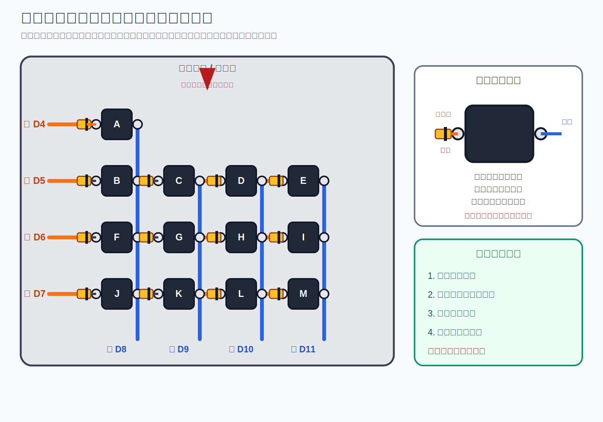
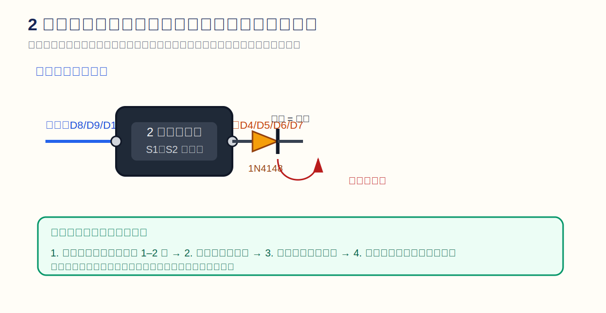
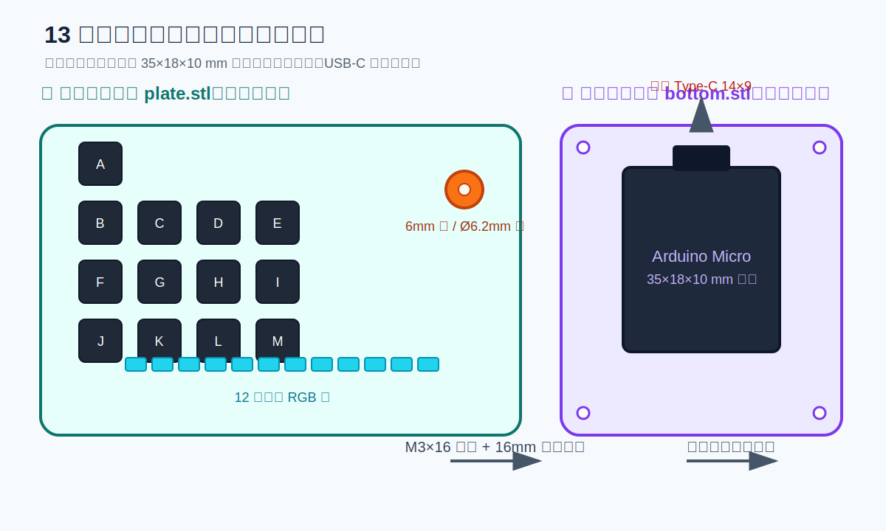
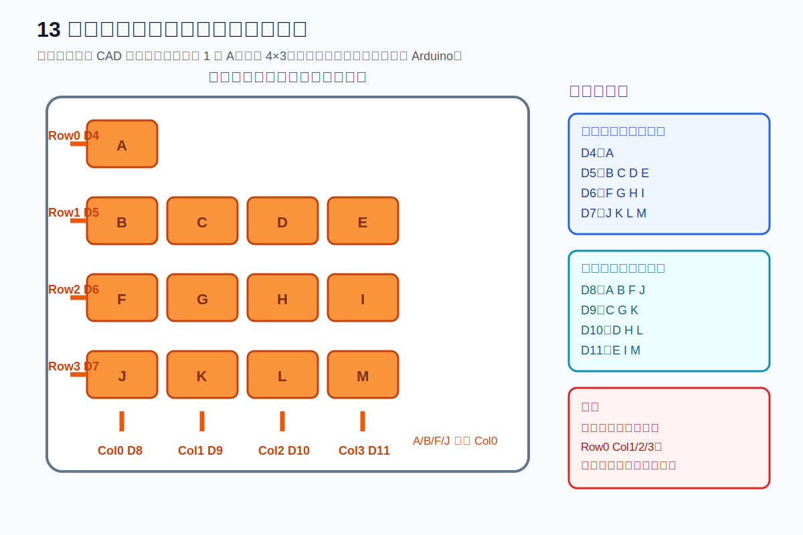
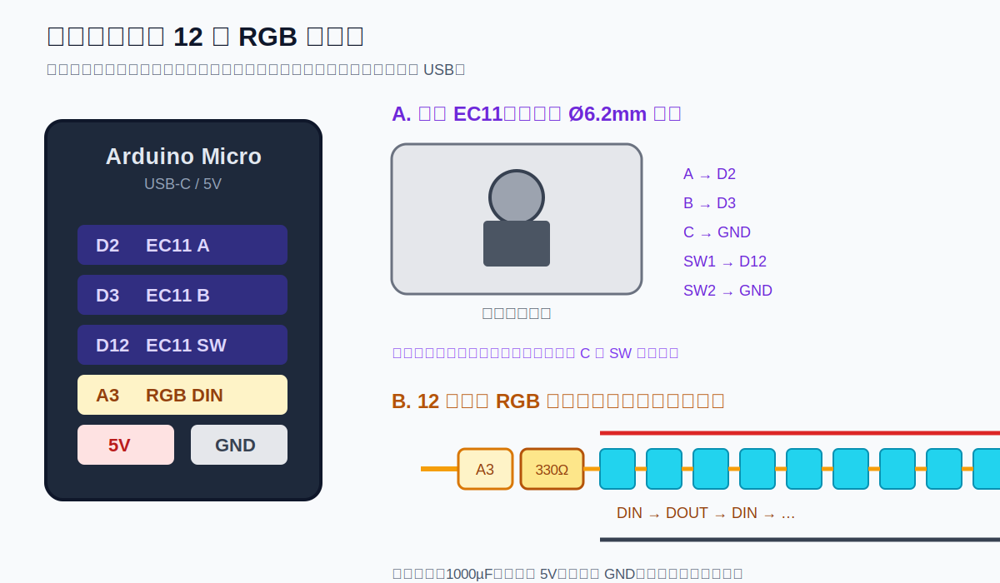

# Rev 0.8.2 从 0 到 1 手焊装配说明书

这份说明书按“**没有定制 PCB，直接把元件焊到导线上**”的路线编写，适合第一次焊接键盘的人。当前你已经拿到除 Arduino Micro 主控板和 RGB 灯带以外的硬件，所以可以先完成按键矩阵、二极管和旋钮；主控板和灯带到货后再做通电测试。

## 先看这张“实物背面图”



你现在只做这张图里的前半部分：把面板翻到背面，看到黑色按键和两个银色针脚；黄色小元件是二极管。每个按键左边接二极管，二极管黑环朝橙色行线，按键右边接蓝色列线。**不要接 USB，也不要把线接到 5V。**

如果只想照着最短步骤做：

1. 先装好 13 个按键。
2. 每个按键左边焊一只二极管，黑环朝橙色行线。
3. 按图把右边针脚接到蓝色列线。
4. 每根橙色/蓝色总线留 10–15cm，贴上 D4、D5、D6、D7、D8、D9、D10、D11 标签。
5. 用万用表检查，主板到货后再接线。

## 先记住这一点：你的按键只有 2 个针脚

按键的两个针脚就是一个普通开关，**没有正负极，左右两脚可以互换**。每个按键还要另外串联一只 1N4148 二极管；二极管不是按键的第三个针脚，黑色环方向才有正负之分。



本项目的目标连接关系是：

```text
列线 D8/D9/D10/D11 ── 按键（两脚任意一侧） ── 二极管 ── 行线 D4/D5/D6/D7
                                                        ↑
                                             二极管黑环朝行线
```

## 你现在要准备的东西

### 已有的硬件

- 13 个两针机械按键和 13 个 1N4148 二极管
- 1 个照片中的立式 EC11 旋转编码器，轴径 6mm
- 3D 打印的 `plate.stl`、`bottom.stl`；可选 `pixel_carrier.stl` 和 `window_lens.stl`
- 26–30 AWG 软导线、M3 螺丝/支柱、旋钮帽、键帽

### 还没到的硬件

- Arduino Micro 兼容主控板：ATmega32U4、5V、16MHz、USB-C
- 5V 可寻址 WS2812B/SK6812 RGB 灯带或 12 颗独立 RGB 灯

### 工具和安全用品

- 可调温电烙铁、烙铁架、黄铜棉或湿海绵
- 细焊锡、助焊剂、斜口钳、尖嘴钳、剥线钳
- 万用表，最好有“二极管测试”档
- 热缩管或绝缘胶带、标签纸/记号笔、镊子
- 护目镜和通风设备

推荐温度：含铅焊锡约 320–340°C；无铅焊锡约 350–370°C。焊接时不要连接 USB-C，也不要让烙铁碰到 PLA/PETG 面板。

## 总体装配顺序



按下面顺序做，每一步完成后都先检查，不要一次把所有线焊完：

1. 试装 3D 打印件和 13 个按键。
2. 练习两个焊点，熟悉烙铁。
3. 安装按键，给每个按键串联二极管。
4. 连接 4 根行线和 4 根列线，留下带标签的线尾。
5. 用万用表检查每个按键、二极管方向和短路情况。
6. 安装并焊接立式 EC11，先不接主控板。
7. 主控板到货后，先用临时线连接并上传固件，再永久整理线束。
8. RGB 灯带到货后，最后接灯带、电阻和电容。
9. 完成上下层装配和最终测试。

## 第 1 步：打印件试装

1. 先打印 `tolerance_coupon.stl`，验证按键孔、6mm 旋钮轴孔和 M3 热熔螺母。
2. 打印 `plate.stl`。从上面看，13 个按键是左上 1 个加下面 4×3 个。
3. 把 13 个按键逐个从面板上方压入，不要用烙铁加热按键孔。
4. 把 EC11 从面板下方放入，6mm 轴穿过面板的约 Ø6.2mm 圆孔。旋钮本体留在面板下方，只有轴和旋钮帽在上方。
5. 旋钮轴如果略紧，只用圆锉或细砂纸轻微扩大；不要把圆孔改成长方孔。
6. 主控板目前还没到，只需要确认 `bottom.stl` 的承托区域、USB-C 前侧开口和上下面板螺丝孔位置。

不要在这一步粘胶。先确认所有零件都能拆下来，后面还要翻到面板背面焊接。

## 第 2 步：先学会一个漂亮焊点

拿一只二极管和一小段废线练习：

1. 烙铁头擦干净并上少量锡。
2. 用尖嘴钳把元件脚或导线固定在焊盘上。
3. 烙铁头同时碰到焊盘和针脚约 1–2 秒。
4. 从烙铁另一侧送入少量焊锡，让焊锡同时润湿焊盘和针脚。
5. 先移开焊锡，再移开烙铁，等 2 秒自然冷却。
6. 合格焊点应像小火山或小圆锥，表面光亮；不要像一颗悬空的焊锡球。

### 三种常见错误

| 现象 | 原因 | 修复 |
|---|---|---|
| 焊锡成球、不粘焊盘 | 焊盘没有被加热或表面有油污 | 加一点助焊剂，再同时加热焊盘和针脚 |
| 焊点灰暗、粗糙 | 冷焊点 | 重新加热至焊锡完全融化，必要时补少量新锡 |
| 两个焊点连成一坨 | 锡太多或线头太长 | 断电后用吸锡带/吸锡器清掉，再重新焊 |

## 第 3 步：安装 13 个两针按键

1. 把上层面板翻到正面，按键从正面压入。
2. 让所有按键方向一致。这样翻到背面后，每个按键的同一侧针脚都可作为“列侧”。
3. 按照下面的编号贴小标签，避免后面焊错。

```text
[ A ][ --][ --][ --]
[ B ][ C ][ D ][ E ]
[ F ][ G ][ H ][ I ]
[ J ][ K ][ L ][ M ]
```

这就是当前 CAD 面板的实际布局：左上单键 A，下面 4×3。为了不混淆，建议直接在按键背面写上 A–M。

注意：按键两脚不分正负，关键是**每个按键必须有一只独立二极管**，并且二极管方向全部一致。

## 第 4 步：焊二极管和按键矩阵

### 4.1 先只完成 A 键

不要一上来焊 13 个。先完成 A：

1. 选定 A 按键的一侧针脚作为列侧，焊一根线，在线尾贴 `COL0 / D8`。
2. A 按键另一侧针脚接 1N4148 二极管的一端。
3. 二极管黑色环的一端接行侧，焊一根线，在线尾贴 `ROW0 / D4`。
4. 用万用表检查线没有脱落，再照这个方法复制到其他按键。

二极管的黑色环是阴极，方向如下：

```text
列侧 ── 按键 ── 二极管无黑环端  |黑环|  ── 行侧
D8/D9/D10/D11                              D4/D5/D6/D7
```

### 4.2 4 根行线和 4 根列线



推荐用橙色线做行线、蓝色线做列线，并让每根总线最后只留下 1 根接主控板的线尾。每根线尾留 10–15cm，末端用热缩管或标签标注。

| 主控脚位 | 行线包含的按键 | 备注 |
|---|---|---|
| D4 | A | Row 0，二极管黑环接这里 |
| D5 | B、C、D、E | Row 1，二极管黑环接这里 |
| D6 | F、G、H、I | Row 2，二极管黑环接这里 |
| D7 | J、K、L、M | Row 3，二极管黑环接这里 |

| 主控脚位 | 列线包含的按键 |
|---|---|
| D8 | A、B、F、J |
| D9 | C、G、K |
| D10 | D、H、L |
| D11 | E、I、M |

三处空位不装按键，也不接线。行线必须接二极管的黑环一侧；列线接按键的另一侧。

### 4.3 线怎么焊才不容易乱

- 先焊所有二极管，再焊行线，最后焊列线。
- 每完成一组就拍照，照片里要能看到标签和焊点。
- 导线剥皮 3–4mm，焊点外不要留很长的裸铜丝。
- 线跨过另一组总线时，用热缩管隔离；不要让裸线交叉接触。
- 不要把行线和列线焊成一个大网。每一个交点都要看清楚是否有绝缘。
- 还没有主控板时，不要把行列线接到 5V、GND 或 USB 外壳。

## 第 5 步：不用主控板也能完成的万用表检查

检查时 USB 必须拔掉，面板上也不能连接任何电源。

### 5.1 外观检查

- [ ] 13 个按键都牢固，没有松动或被面板卡住。
- [ ] 13 个二极管都存在，黑环方向统一。
- [ ] D4–D7 四根行线有标签，D8–D11 四根列线有标签。
- [ ] 没有焊锡桥，没有露出的长线头。
- [ ] 6mm 旋钮轴能自由转动，不碰面板孔边。

### 5.2 每个按键逐个测

把万用表拨到二极管测试档。以 A 键为例：

1. 按住 A 键。
2. 红表笔接 A 的列侧（D8），黑表笔接 A 的行侧（D4，二极管黑环一侧）。
3. 应看到约 0.5–0.8V 的二极管压降。
4. 松开 A 键，读数应恢复为断路/OL。
5. 交换红黑表笔，应该是断路/OL；若反向也导通，二极管方向或焊接可能错误。

依次检查 A–M。若某键两边都 OL，优先检查按键脚、二极管脚和该键的线尾；若两边都接近 0V，优先检查焊锡桥。

### 5.3 总线检查

- D4、D5、D6、D7 之间应互不导通。
- D8、D9、D10、D11 之间应互不导通。
- 未按键时，任意行列组合不应出现低阻短路。
- 按下某键时，只允许它对应的行列组合出现二极管压降。

这一步通过后，键盘面板的核心焊接已经完成。即使主控板晚几天到，也不要急着接电测试。

## 第 6 步：安装立式 EC11 旋钮

当前模型适配的是照片中的**立式/垂直轴 EC11**，不是卧式、侧插型编码器。面板孔是圆形约 Ø6.2mm，用来给 6mm 轴预留 FDM 打印间隙。



### 6.1 机械安装

1. 从面板下方放入 EC11，本体贴在面板背面。
2. 让 6mm 轴从面板圆孔伸出。
3. 先装旋钮帽，确认旋转不刮擦面板；不要用过大的旋钮帽硬压轴。
4. EC11 本体用短线焊接，线长以能翻开面板维修为准，不要拉紧。

### 6.2 电气接线

EC11 不同厂家针脚顺序可能不同，不能只看外观猜。常见 5 脚逻辑如下：

| EC11 功能 | Arduino Micro |
|---|---|
| A / CLK | D2 |
| B / DT | D3 |
| C / COM | GND |
| SW1 | D12 |
| SW2 | GND |

无主控板时，用万用表找脚：旋转时 A/C、B/C 会交替通断；按下时 SW1/SW2 才通断。找到后给五根线分别贴 `ENC_A`、`ENC_B`、`ENC_GND`、`ENC_SW`、`ENC_SW_GND`。

不要把 EC11 的公共脚直接接 5V。固件使用 Arduino 的 `INPUT_PULLUP`，主控到货后再按上表接线。

## 第 7 步：RGB 灯带现在先不要焊

灯带还没到时，你现在只需要：

1. 打印 `pixel_carrier.stl`，确认 12 个灯位间距和面板窗口合适。
2. 在面板上试放承载条，不要用烙铁烫灯孔。
3. 把将来要接灯带的线位写好：`A3/DATA`、`5V`、`GND`。

到货后必须确认是 **5V 可寻址** WS2812B/SK6812；普通 12V RGB 灯带或只有四根模拟 RGB 线的灯带不能直接使用当前固件。接线关系是：

```text
A3 ── 330Ω ── DIN [灯0] DOUT ── DIN [灯1] DOUT ── … ── [灯11]
5V ─────────────────────── 并联到每一颗灯的 5V
GND ────────────────────── 并联到每一颗灯的 GND
```

在灯带电源入口并联 1000µF 电解电容：电容正极接 5V，负极接 GND。灯带箭头必须从 Arduino A3 指向灯 0，再指向灯 1；方向反了会全不亮。

## 第 8 步：主控板到货后的第一次通电

### 8.1 先临时接线，不要马上永久焊

主控板到货后，先用杜邦线或临时焊线连接：

```text
ROW0 D4    ROW1 D5    ROW2 D6    ROW3 D7
COL0 D8    COL1 D9    COL2 D10   COL3 D11
EC11 A D2  EC11 B D3  EC11 SW D12
所有 GND 共地；RGB 暂时不接，ENABLE_RGB 保持 0
```

1. 目测主控板没有桥接或弯针。
2. 万用表测主控板 5V 与 GND，不应短路。
3. 只连接 USB-C，确认电脑识别 Arduino Micro。
4. Arduino IDE 选择 `Tools > Board > Arduino Micro`。
5. 先上传 Blink，再上传 `firmware/arduino/agent_macro_mvp/agent_macro_mvp.ino`。
6. 在空白文本框中逐个按 A–M，确认没有漏键或串键。
7. 旋转 EC11，确认方向；方向反了就交换 D2/D3 两根线。

如果上传时端口消失，快速按两次 Reset，再选择 Bootloader 串口。USB-C 线必须是数据线，不是只有充电的线。

当前固件的默认动作是：A=Enter，B=Esc，C=Ctrl+N，D=Ctrl+Shift+D，E–M=F1–F9；这是通用宏占位，后续可按 Codex、Claude、Qoder 的实际快捷键修改。

## 第 9 步：RGB 到货后的测试顺序

1. 先只接 1 颗 RGB 灯、330Ω 电阻和 5V/GND。
2. `ENABLE_RGB` 改为 `1`，安装 Arduino IDE 的 Adafruit NeoPixel 库并上传。
3. 先用 20–30% 亮度测试，不要一开始全白满亮度。
4. 单颗正常后，再接完 12 颗，确认 DIN/DOUT 方向和共地。
5. 最后用主机工具测试：

   ```bash
   python host/agentd/agentd.py --list
   python host/agentd/agentd.py --port /dev/cu.usbmodemXXXX --quota 50
   ```

Windows 下串口通常是 `COM3` 这类名称。USB 供电时，如果 12 灯点亮导致主控重启，先降低亮度，检查电容和电源线，不要继续满亮度运行。

## 第 10 步：最终机械装配


1. 拔掉 USB-C。
2. Arduino Micro 固定在 `bottom.stl` 右侧主板承托区，USB-C 对准前侧开口。
3. 将 RGB 灯和导线固定在 `pixel_carrier.stl`，确保灯珠正面朝向面板窗口。
4. 整理矩阵和 EC11 线束，所有裸露焊点加热缩管或绝缘胶带。
5. 可选地将 `window_lens.stl` 或透明亚克力片放入主板观察窗。
6. 用四个 M3×12mm 螺丝和 10mm 支柱连接上下层面板，先松装，确认线束没有被夹住。
7. 插拔一次 USB-C，确认插头不会顶住外壳，之后再均匀拧紧四角螺丝。
8. 贴防滑脚垫，完成最终测试。

## 出现问题时按这个顺序排查

| 现象 | 先检查 |
|---|---|
| 某一个按键不响应 | 按键两脚是否有焊点、二极管黑环是否朝行线、该键线尾是否断 |
| 一整行不响应 | D4–D7 对应行线是否断路，是否把二极管黑环焊到了列线 |
| 一整列不响应 | D8–D11 对应列线是否断路，列线是否焊到按键同一侧 |
| 多个键一起误触 | 行列之间有锡桥、裸线交叉短路，或二极管方向不统一 |
| EC11 方向反了 | 交换 A/B 两根线；不要交换公共 GND |
| USB 完全不识别 | USB-C 是否为数据线、主控是否为 ATmega32U4 5V/16MHz、双击 Reset |
| RGB 全不亮 | `ENABLE_RGB`、5V/GND 极性、A3 到 DIN、电阻位置、箭头方向 |
| RGB 一亮就重启 | 降低亮度、接 1000µF 电容、检查 5V/GND 和 USB 供电余量 |

## 完成标准

- [ ] 13 个两针按键全部安装，按键本身没有极性。
- [ ] 13 个 1N4148 二极管全部串联，黑环统一朝 D4–D7 行线。
- [ ] 4 根行线和 4 根列线都贴有明确标签。
- [ ] 万用表逐键测到正确的单向二极管压降。
- [ ] 立式 EC11 6mm 轴穿过约 Ø6.2mm 圆孔，旋转和按压不刮面板。
- [ ] 主控板到货后先在开盖状态测试，再进行最终装配。
- [ ] RGB 灯带确认是 5V 可寻址型号，并按 DIN→DOUT 方向连接。

相关资料：[引脚表](../hardware/wiring/pinout.md)、[硬件测试计划](../hardware/test-plan.md)、[采购清单](../hardware/purchase-list.md)、[打印计划](../mechanical/print/PRINT_PLAN.md)。
